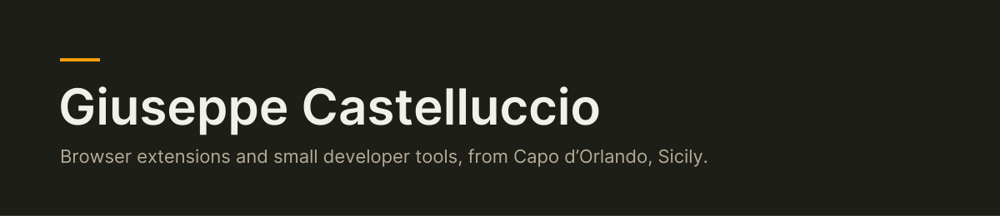

<picture>
  <source media="(prefers-color-scheme: dark)" srcset="assets/header-dark.svg">
  <source media="(prefers-color-scheme: light)" srcset="assets/header-light.svg">
  
</picture>

I live in Capo d'Orlando, Sicily, and build browser extensions and small developer tools. I run my own servers at home (Docker, Caddy, Postgres, backups) and learn mostly by fixing what breaks.

## Browser extensions

| Extension | What it does | Stores |
|---|---|---|
| GigScope | Checks your Fiverr gig rank by keyword and shows competitor ratings, reviews and prices on search pages. | [Chrome](https://chromewebstore.google.com/detail/gigscope-for-fiverr/hefjmklbfmgljmdkobekdkneamihibof), [Edge](https://microsoftedge.microsoft.com/addons/detail/mppmlngecfpdbbcofombkhfekpdblmbm) |
| Listrank | Etsy rank tracker: rank by keyword, shop audit from a CSV, bulk title and tag fixes. | [Chrome](https://chromewebstore.google.com/detail/listrank-etsy-rank-checke/jdndfjhhepnfgemjdjkpcgfnehedbpak), [Edge](https://microsoftedge.microsoft.com/addons/detail/dcijmbnlnmbjmgomgccaoclbkoggpemp), [Firefox](https://addons.mozilla.org/firefox/addon/listrank-etsy-rank-checker-seo/) |
| Takelight | Screen recorder that records on your computer, with no account. Captions are made on your device. | [Chrome](https://chromewebstore.google.com/detail/kcpcjjkialleiglnjpngkomcdeoabdgl) |
| Twinread | Translates a web page and shows the translation under each paragraph, on your device. | [Chrome](https://chromewebstore.google.com/detail/twinread-bilingual-page-t/iikpomdgmfkbmojldmijclclacidlofm) |
| Tabsafe | Saves your open tabs and windows, logs closed tabs, imports OneTab and Session Buddy lists. | [Edge](https://microsoftedge.microsoft.com/addons/detail/pfpfkememjgolkgkmngjhblbcepfkfig) |
| Chatshelf | Puts ChatGPT, Claude and Gemini chats in folders, with search and Markdown export. | [Edge](https://microsoftedge.microsoft.com/addons/detail/ckgcmaglejifhgpbemkfkknmgpnomjio) |

Streamgrab, Shelfverdict and Storeprobe are in store review.

## Developer tools

| Tool | What it does |
|---|---|
| [handoff](https://github.com/exochard/handoff) | Carries a project's state (goal, decisions, what not to retry) across coding-agent sessions, so a fresh one doesn't start from scratch. |
| [delegate](https://github.com/exochard/delegate) | Sends a coding task to a worker in its own git worktree, then reports back a diff to review. |

## Links

[Portfolio](https://giuseppe-castelluccio-site.vercel.app) · [LinkedIn](https://www.linkedin.com/in/giuseppe-castelluccio-34008b39b)
