# Giuseppe Castelluccio

Sicily, Italy. Native Italian, working English.

## What I do

I'm learning self-hosted infrastructure by running my own stack. Docker, Caddy as a
reverse proxy, TLS, Postgres, backup and restore. Most of it I've picked up by breaking
things on a home server and fixing them.

I'm also building small self-hosted tools for local businesses — one at a time, nothing
sold yet.

And I build small developer tools. Two of them are public.

| | |
|---|---|
| **[handoff](https://github.com/exochard/handoff)** | Carries a project's state (goal, decisions, what not to retry) across coding-agent sessions, so a fresh one doesn't re-derive it from scratch. |
| **[delegate](https://github.com/exochard/delegate)** | Sends a coding task to a worker in its own git worktree, then reports back a diff to review. |

## Elsewhere

- [giuseppe-castelluccio-site.vercel.app](https://giuseppe-castelluccio-site.vercel.app)
- [linkedin.com/in/giuseppe-castelluccio-34008b39b](https://www.linkedin.com/in/giuseppe-castelluccio-34008b39b)
